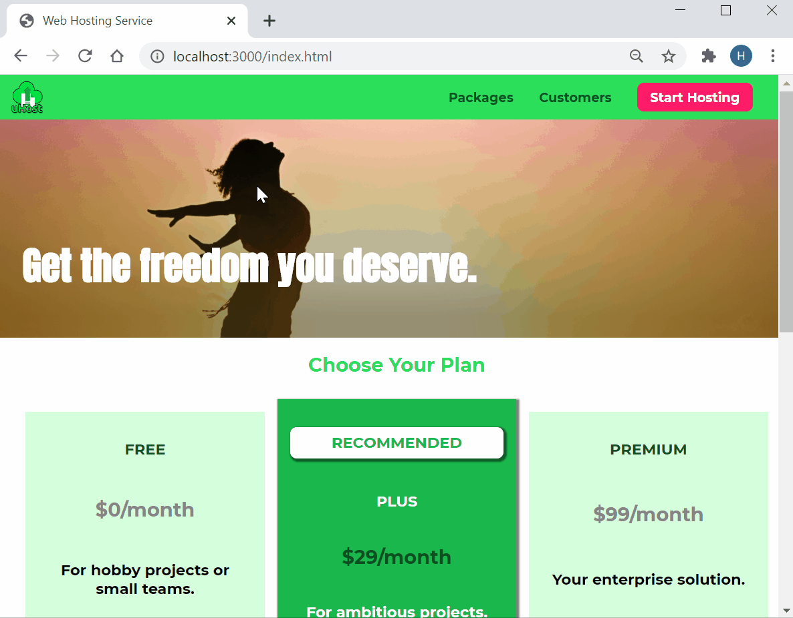
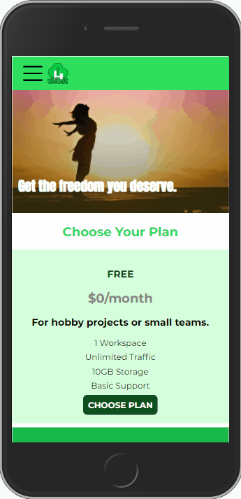

# Basics of CSS

This project demonstrates basic concepts of CSS.

| `Desktop` or `Laptop` | `Smartphone` |
|-----------------------|---------------|
|  |  |

## 3rd-Party Packages

The project uses the following 3rd-party [Node.js](https://nodejs.org/) package

| Package | Type | Purpose |
|---------|------|---------|
| [lite-server](https://www.npmjs.com/package/lite-server) | `dev` | A lightweight development `Node.js` server that serves a web app, opens it in the browser, refreshes when html or javascript change, injects CSS changes and has a fallback page when a route is not found |

## Source Code

Switch the source code to versions described below to view different implementations.

| Git Tag | Implementation |
|---------|----------------|
| [v1.0.0](https://github.com/TranXuanHoang/TheWeb/releases/tag/v1.0.0) | Create uHost website |
| [v1-3.0.1](https://github.com/TranXuanHoang/TheWeb/releases/tag/v1-3.0.1) | A shared release of both `uHost` and [03-grid](../03-grid) websites |
| [v1-3.0.2](https://github.com/TranXuanHoang/TheWeb/releases/tag/v1-3.0.2) | A shared release of both `uHost` and [03-grid](../03-grid) websites - add app captures and update readme files |

## Run App

* Install `Node.js` dependencies with `npm install`
* Run app with `npm start`
